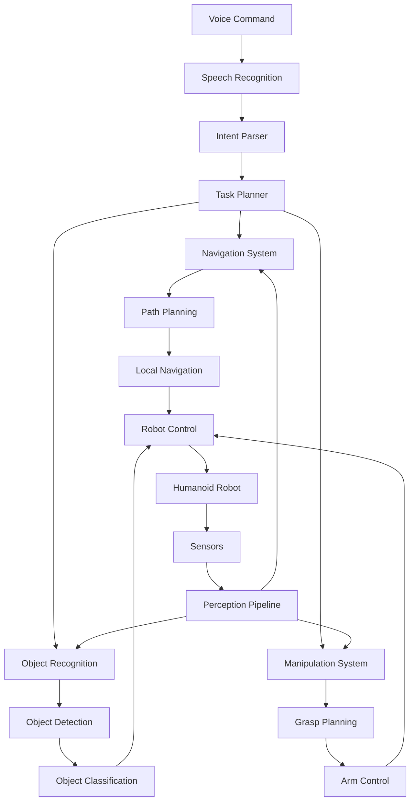

# Capstone Project Overview: The Autonomous Humanoid

## Introduction

The capstone project represents the culmination of your journey through the Physical AI & Humanoid Robotics curriculum. In this project, you'll integrate all the concepts learned across Modules 1-4 to create a complete autonomous humanoid system capable of understanding voice commands, navigating environments, recognizing objects, and executing complex tasks.

## Project Architecture

The autonomous humanoid system is built upon a comprehensive architecture that combines all the technologies and concepts learned in previous modules:

## System Components Integration

The autonomous humanoid system integrates components from all four modules:

### Module 1: The Robotic Nervous System (ROS 2)
- **Communication Infrastructure**: The entire system relies on ROS 2 for message passing between components
- **Node Architecture**: Each subsystem operates as a separate ROS 2 node
- **Topics and Services**: Communication patterns established for inter-component data exchange

### Module 2: The Digital Twin (Gazebo & Unity)
- **Simulation Environment**: Testing and validation of the integrated system
- **Sensor Simulation**: LiDAR, cameras, and IMUs for perception
- **Physics Simulation**: Realistic humanoid robot dynamics

### Module 3: The AI-Robot Brain (NVIDIA Isaac)
- **Visual SLAM**: Environment mapping and localization
- **Navigation Stack**: Path planning and obstacle avoidance
- **AI Perception**: Deep learning models for object recognition

### Module 4: Vision-Language-Action (VLA)
- **Voice Command Processing**: Natural language understanding
- **Cognitive Planning**: Task decomposition and execution
- **Multi-modal Integration**: Combining vision, language, and action

## Project Pipeline

The complete pipeline from voice command to action follows this sequence:

1. **Voice Input**: User speaks a command to the humanoid robot
2. **Speech Recognition**: Convert speech to text using OpenAI Whisper
3. **Intent Parsing**: Extract actionable intents from natural language
4. **Task Planning**: Decompose high-level commands into executable actions
5. **Perception**: Sense the environment using cameras, LiDAR, and other sensors
6. **Navigation**: Plan and execute movement to required locations
7. **Object Recognition**: Identify and classify relevant objects
8. **Manipulation**: Execute physical actions using robot arms
9. **Feedback**: Report completion status to the user

## Implementation Requirements

The autonomous humanoid system must satisfy the following requirements:

- **Real-time Performance**: Respond to voice commands within 3 seconds
- **Robust Navigation**: Navigate complex environments with 95% success rate
- **Accurate Recognition**: Identify objects with 90% accuracy
- **Safe Operation**: Implement safety checks to prevent harm to humans or environment
- **Modular Design**: Components must be replaceable and upgradable

## Development Approach

The project will be developed iteratively with the following phases:

1. **System Integration**: Connect all modules and establish communication
2. **Basic Functionality**: Implement simple voice command → action pipeline
3. **Enhanced Capabilities**: Add complex navigation and manipulation
4. **Optimization**: Improve performance and reliability
5. **Testing**: Validate system in various scenarios

## Expected Outcomes

Upon completion of this capstone project, you will have:

- A fully integrated autonomous humanoid system
- Understanding of how to combine multiple AI and robotics technologies
- Experience with complex system integration challenges
- Knowledge of debugging and optimization techniques for multi-component systems

## Prerequisites

Before beginning this capstone project, ensure you have completed and understand:

- Module 1: ROS 2 communication patterns
- Module 2: Sensor simulation and physics
- Module 3: AI perception and navigation
- Module 4: Voice processing and cognitive planning

## Next Steps

In the following sections, we'll implement each component of the autonomous humanoid system, starting with voice command processing, followed by navigation, object recognition, and finally integration and demonstration.