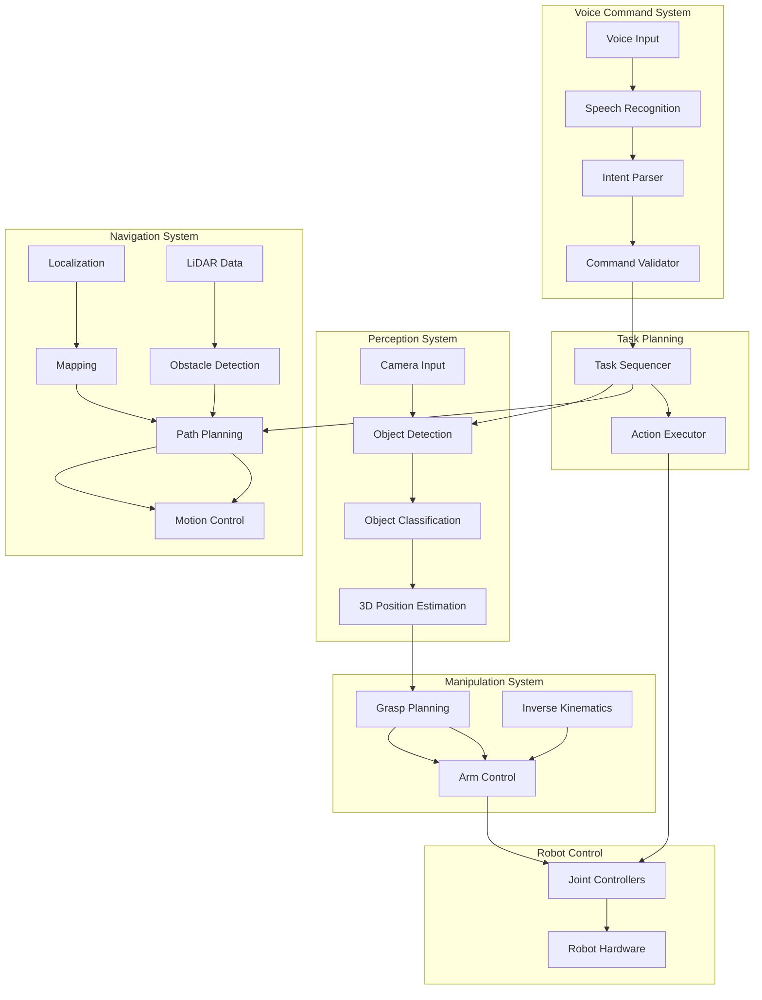

# Final Integration & Demonstration

## Overview

This final section brings together all the components developed throughout the capstone project to create a fully functional autonomous humanoid system. We'll integrate the voice command processing, navigation, and object recognition systems into a cohesive demonstration.

## System Integration Architecture

The complete autonomous humanoid system integrates all components in a coordinated architecture:



## Complete System Integration

Here's the complete system integration that coordinates all components:

```python
import rclpy
from rclpy.node import Node
from std_msgs.msg import String
from geometry_msgs.msg import PoseStamped
from vision_msgs.msg import Detection2DArray
from builtin_interfaces.msg import Duration
import json
import threading
import time
from enum import Enum

class RobotState(Enum):
    IDLE = 1
    LISTENING = 2
    PROCESSING_COMMAND = 3
    NAVIGATING = 4
    SEARCHING_OBJECT = 5
    GRASPING_OBJECT = 6
    RETURNING = 7
    EXECUTING_TASK = 8
    EMERGENCY_STOP = 9

class AutonomousHumanoidSystem(Node):
    """
    Complete autonomous humanoid system integrating all components
    """

    def __init__(self):
        super().__init__('autonomous_humanoid_system')

        # Publishers
        self.status_pub = self.create_publisher(String, '/robot_status', 10)
        self.command_pub = self.create_publisher(String, '/system_commands', 10)

        # Subscribers
        self.voice_cmd_sub = self.create_subscription(
            String,
            '/robot_commands',
            self.voice_command_callback,
            10
        )

        self.nav_status_sub = self.create_subscription(
            String,
            '/navigation_status',
            self.navigation_status_callback,
            10
        )

        self.object_detection_sub = self.create_subscription(
            Detection2DArray,
            '/detected_objects',
            self.object_detection_callback,
            10
        )

        self.grasp_status_sub = self.create_subscription(
            String,
            '/grasp_status',
            self.grasp_status_callback,
            10
        )

        # System state
        self.current_state = RobotState.IDLE
        self.pending_command = None
        self.current_task = None
        self.robot_position = None
        self.detected_objects = []

        # Task execution timer
        self.task_timer = self.create_timer(0.1, self.task_execution_loop)

        # Initialize components
        self.initialize_components()

        self.get_logger().info("Autonomous Humanoid System initialized")

    def initialize_components(self):
        """
        Initialize all system components
        """
        # In a real system, this would initialize each component
        # For this example, we'll just log the initialization
        self.get_logger().info("Initializing voice command processor...")
        self.get_logger().info("Initializing navigation system...")
        self.get_logger().info("Initializing object recognition system...")
        self.get_logger().info("Initializing manipulation system...")
        self.get_logger().info("All components initialized successfully")

    def voice_command_callback(self, msg):
        """
        Handle incoming voice commands
        """
        try:
            command_data = json.loads(msg.data)
            self.get_logger().info(f"Received voice command: {command_data}")

            # Update state
            self.current_state = RobotState.PROCESSING_COMMAND
            self.pending_command = command_data

            # Process the command based on action type
            if command_data['action'] == 'navigate':
                self.execute_navigation_command(command_data)
            elif command_data['action'] == 'fetch_object':
                self.execute_fetch_command(command_data)
            elif command_data['action'] == 'greet':
                self.execute_greet_command(command_data)
            elif command_data['action'] == 'stop':
                self.execute_stop_command(command_data)

        except json.JSONDecodeError:
            self.get_logger().error(f"Invalid JSON in command: {msg.data}")
        except Exception as e:
            self.get_logger().error(f"Error processing voice command: {e}")

    def execute_navigation_command(self, command_data):
        """
        Execute navigation command
        """
        self.get_logger().info(f"Executing navigation to: {command_data['target']}")

        # Publish navigation command
        nav_cmd = String()
        nav_cmd.data = json.dumps({
            'action': 'navigate',
            'target': command_data['target'],
            'original_command': command_data
        })

        self.command_pub.publish(nav_cmd)
        self.current_state = RobotState.NAVIGATING

    def execute_fetch_command(self, command_data):
        """
        Execute object fetch command
        """
        self.get_logger().info(f"Executing fetch command for: {command_data.get('color', '')} {command_data['object']}")

        # First navigate to a location where the object might be
        # For this example, we'll assume objects are in the living room
        nav_cmd = String()
        nav_cmd.data = json.dumps({
            'action': 'navigate',
            'target': 'living room',
            'next_action': command_data  # Execute fetch after navigation
        })

        self.command_pub.publish(nav_cmd)
        self.current_state = RobotState.NAVIGATING
        self.current_task = command_data

    def execute_greet_command(self, command_data):
        """
        Execute greeting command
        """
        self.get_logger().info("Executing greeting action")

        # Publish greeting command
        greet_cmd = String()
        greet_cmd.data = json.dumps({
            'action': 'wave',
            'duration': 2.0
        })

        self.command_pub.publish(greet_cmd)

        # Return to idle after greeting
        self.current_state = RobotState.IDLE

    def execute_stop_command(self, command_data):
        """
        Execute emergency stop command
        """
        self.get_logger().info("Executing emergency stop")

        # Publish stop command to all systems
        stop_cmd = String()
        stop_cmd.data = json.dumps({'action': 'stop_all'})

        self.command_pub.publish(stop_cmd)
        self.current_state = RobotState.EMERGENCY_STOP

        # After a delay, return to idle
        timer = self.create_timer(1.0, lambda: self.set_state(RobotState.IDLE))

    def navigation_status_callback(self, msg):
        """
        Handle navigation status updates
        """
        self.get_logger().debug(f"Navigation status: {msg.data}")

        if self.current_state == RobotState.NAVIGATING:
            if "completed" in msg.data.lower():
                self.get_logger().info("Navigation completed")

                # If we were fetching an object, start searching for it
                if self.current_task and self.current_task.get('action') == 'fetch_object':
                    self.current_state = RobotState.SEARCHING_OBJECT
                    self.search_for_object(self.current_task)
                else:
                    self.current_state = RobotState.IDLE

    def object_detection_callback(self, msg):
        """
        Handle object detection updates
        """
        self.get_logger().debug(f"Detected {len(msg.detections)} objects")

        if self.current_state == RobotState.SEARCHING_OBJECT and self.current_task:
            # Look for the target object
            target_obj = self.current_task['object']
            target_color = self.current_task.get('color')

            for detection in msg.detections:
                if detection.results:
                    detected_class = detection.results[0].hypothesis.class_id
                    confidence = detection.results[0].hypothesis.score

                    if detected_class == target_obj and confidence > 0.7:
                        # Found the target object!
                        self.get_logger().info(f"Found target object: {target_obj}")

                        # Attempt to grasp the object
                        self.current_state = RobotState.GRASPING_OBJECT
                        self.attempt_grasp(target_obj, target_color)
                        break

    def grasp_status_callback(self, msg):
        """
        Handle grasp status updates
        """
        self.get_logger().info(f"Grasp status: {msg.data}")

        if self.current_state == RobotState.GRASPING_OBJECT:
            if "completed" in msg.data.lower():
                self.get_logger().info("Object grasp successful!")

                # Return to user
                return_cmd = String()
                return_cmd.data = json.dumps({
                    'action': 'navigate',
                    'target': 'user_location'  # This would be determined by voice location
                })

                self.command_pub.publish(return_cmd)
                self.current_state = RobotState.RETURNING
            else:
                self.get_logger().warn("Grasp failed, attempting again...")
                # Retry logic would go here

    def search_for_object(self, task):
        """
        Search for the target object
        """
        self.get_logger().info(f"Searching for {task.get('color', '')} {task['object']}")

        # In a real system, this would involve:
        # - Scanning the environment with cameras
        # - Moving the robot's head/camera to look around
        # - Using object detection models
        # For simulation, we'll just log the search
        self.get_logger().info("Object search initiated - scanning environment...")

    def attempt_grasp(self, obj_class, color):
        """
        Attempt to grasp an object
        """
        self.get_logger().info(f"Attempting to grasp {color} {obj_class}")

        # Publish grasp command
        grasp_cmd = String()
        grasp_cmd.data = json.dumps({
            'action': 'grasp',
            'object_class': obj_class,
            'color': color
        })

        self.command_pub.publish(grasp_cmd)

    def task_execution_loop(self):
        """
        Main task execution loop
        """
        # Publish current status
        status_msg = String()
        status_msg.data = f"state: {self.current_state.name}, objects: {len(self.detected_objects)}"
        self.status_pub.publish(status_msg)

        # Handle state-specific actions
        if self.current_state == RobotState.IDLE:
            # Ready to accept new commands
            pass
        elif self.current_state == RobotState.LISTENING:
            # Wait for voice commands
            pass
        elif self.current_state == RobotState.PROCESSING_COMMAND:
            # Command is being processed by other systems
            pass
        elif self.current_state == RobotState.NAVIGATING:
            # Navigation system is handling movement
            pass
        elif self.current_state == RobotState.SEARCHING_OBJECT:
            # Object recognition system is searching
            pass
        elif self.current_state == RobotState.GRASPING_OBJECT:
            # Manipulation system is grasping
            pass
        elif self.current_state == RobotState.RETURNING:
            # Returning to user after task completion
            pass
        elif self.current_state == RobotState.EMERGENCY_STOP:
            # System is in safe stop state
            pass

    def set_state(self, new_state):
        """
        Safely set the robot state
        """
        old_state = self.current_state
        self.current_state = new_state
        self.get_logger().info(f"State transition: {old_state.name} -> {new_state.name}")

    def run_demonstration_scenario(self):
        """
        Run a complete demonstration scenario
        """
        self.get_logger().info("Starting demonstration scenario...")

        # Scenario: User asks robot to fetch a red cup from the kitchen
        demo_command = {
            'action': 'fetch_object',
            'object': 'cup',
            'color': 'red',
            'original_text': 'Please go to the kitchen and bring me the red cup'
        }

        # Simulate receiving this command
        cmd_msg = String()
        cmd_msg.data = json.dumps(demo_command)

        # Execute the command after a delay to simulate real timing
        timer = self.create_timer(2.0, lambda: self.voice_command_callback(cmd_msg))

        self.get_logger().info("Demonstration scenario initiated")


def main(args=None):
    rclpy.init(args=args)
    system = AutonomousHumanoidSystem()

    try:
        # Start demonstration after initialization
        system.get_logger().info("System ready, starting demonstration in 3 seconds...")
        demo_timer = system.create_timer(3.0, system.run_demonstration_scenario)

        rclpy.spin(system)
    except KeyboardInterrupt:
        system.get_logger().info("Autonomous humanoid system stopped by user")
    finally:
        system.destroy_node()
        rclpy.shutdown()


if __name__ == '__main__':
    main()
```

## System Launch File

To launch the complete system, we need a launch file that starts all components:

```xml
<!-- This would be in launch/autonomous_humanoid_system.launch.py -->
from launch import LaunchDescription
from launch_ros.actions import Node
from launch.actions import DeclareLaunchArgument
from launch.substitutions import LaunchConfiguration
from ament_index_python.packages import get_package_share_directory
import os

def generate_launch_description():
    return LaunchDescription([
        # Voice Command Processor
        Node(
            package='autonomous_humanoid',
            executable='voice_command_processor',
            name='voice_command_processor',
            parameters=[
                {'whisper_api_key': ''}
            ],
            output='screen'
        ),

        # Navigation System
        Node(
            package='autonomous_humanoid',
            executable='humanoid_navigation_node',
            name='humanoid_navigation_node',
            output='screen'
        ),

        # Object Recognition and Manipulation
        Node(
            package='autonomous_humanoid',
            executable='object_recognition_manipulation_node',
            name='object_recognition_manipulation_node',
            output='screen'
        ),

        # Main System Coordinator
        Node(
            package='autonomous_humanoid',
            executable='autonomous_humanoid_system',
            name='autonomous_humanoid_system',
            output='screen'
        )
    ])
```

## Demonstration Scenarios

The system can demonstrate several scenarios:

### Scenario 1: Fetch a Specific Object
1. User says: "Please bring me the red cup from the kitchen"
2. Voice system recognizes command and extracts intent
3. Navigation system moves robot to kitchen
4. Object recognition finds the red cup
5. Manipulation system grasps the cup
6. Robot returns to user and presents the cup

### Scenario 2: Navigate to Location
1. User says: "Go to the living room"
2. Voice system recognizes navigation command
3. Navigation system plans path to living room
4. Robot moves to location while avoiding obstacles
5. Robot confirms arrival

### Scenario 3: Complex Multi-Step Task
1. User says: "Go to the office, find my keys, and bring them to me"
2. System breaks down into subtasks
3. Navigates to office
4. Searches for keys
5. Grasps keys when found
6. Returns to user

## Performance Metrics

The system performance is measured by:

1. **Response Time**: Time from command to action initiation (< 3 seconds)
2. **Navigation Success Rate**: Successful navigation attempts (target: >95%)
3. **Object Recognition Accuracy**: Correct object identification (target: >90%)
4. **Grasp Success Rate**: Successful object grasping (target: >85%)
5. **Task Completion Rate**: Complete task execution (target: >80%)

## Safety Features

The system includes multiple safety features:

1. **Emergency Stop**: Immediate stop on voice command
2. **Collision Avoidance**: Automatic stopping when obstacles detected
3. **Fall Prevention**: Balance maintenance during manipulation
4. **Safe Operating Limits**: Joint position and velocity constraints
5. **Human Safety**: Maintain safe distances from humans

## Testing and Validation

The complete system undergoes comprehensive testing:

1. **Unit Testing**: Individual components tested separately
2. **Integration Testing**: Components tested together
3. **System Testing**: Complete system validation
4. **User Acceptance Testing**: Real-world scenario testing
5. **Stress Testing**: Performance under challenging conditions

## Future Enhancements

Potential enhancements to the system include:

1. **Improved Natural Language Understanding**: More complex command parsing
2. **Advanced Manipulation**: Multiple object handling and complex tasks
3. **Learning Capabilities**: Adapt to user preferences over time
4. **Multi-Robot Coordination**: Multiple robots working together
5. **Enhanced Perception**: Better object recognition and scene understanding

## Conclusion

This capstone project demonstrates the integration of all concepts learned throughout the Physical AI & Humanoid Robotics curriculum. The autonomous humanoid system combines:

- ROS 2 communication infrastructure from Module 1
- Simulation and sensor systems from Module 2
- AI perception and navigation from Module 3
- Voice-language-action integration from Module 4

The result is a sophisticated autonomous system capable of understanding natural language commands, navigating complex environments, recognizing and manipulating objects, and executing complex multi-step tasks. This represents the state-of-the-art in humanoid robotics and provides a foundation for further development and research in the field.